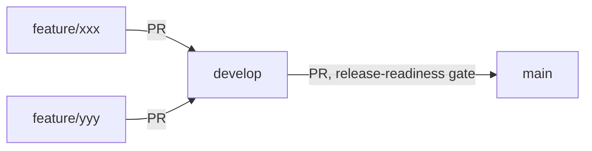

# Development Workflow

This project is a solo-developer learning vehicle that deliberately follows a
multi-developer-style Git/CI process (branch protection, PR review discipline,
CI gates) even though there is currently one contributor and one physical
Raspberry Pi 4. The workflow is designed so it scales cleanly if/when real
collaborators join.

## Branch model (GitFlow, reduced)



- **`main`** — always release-able. Only receives merges via PR from `develop`.
  Protected: no direct pushes, PR required, required status checks must pass.
- **`develop`** — integration branch. Only receives merges via PR from
  `feature/*`. Protected the same way as `main`, minus the hardware-in-loop
  gate (see below).
- **`feature/<short-name>`** — one per unit of work, branched from `develop`,
  short-lived, deleted after merge.

No `release/*` or `hotfix/*` branches for now — not worth the ceremony at this
project's size. Add them later if a real release cadence emerges.

### Why protect branches even solo?

GitHub branch protection doesn't require a *second human* reviewer to be
useful — "require PR before merging" + "require status checks to pass" alone
stops you from fast-pushing a broken commit straight to `main` at 11pm and
finding out in the morning. That discipline is the point of this exercise.
Self-approving your own PR is fine; skipping CI is what's being prevented.

Suggested settings (Settings → Branches → Add rule), applied to both `main`
and `develop`:
- Require a pull request before merging (approvals: 0, since solo)
- Require status checks to pass before merging → select the `lint`,
  `build-test`, `cross-compile-arm64` jobs (and `native-build-test` from
  `hw-in-loop.yml` for `main` only)
- Do not allow bypassing the above settings
- Require branches to be up to date before merging (optional; keeps CI honest
  on rebase-heavy history)

These are **not applied yet** — they're a repo-settings change on GitHub,
listed here for you to apply via the UI or `gh api`, not something done
automatically as part of this change.

## CI pipeline

### `ci.yml` — every PR into `develop`/`main`, and every push to those branches

Runs entirely on GitHub-hosted `ubuntu-latest`, no Pi required:

| Job | What | Blocking? |
|---|---|---|
| `lint` | `clang-format --dry-run`, `clang-tidy` | **No** (see "Lint debt" below) |
| `build-test` | matrix over `gcc-dev-Debug` / `gcc-dev-Release` / `gcc-dev-ASan`, `ctest` | Yes |
| `cross-compile-arm64` | compiles (doesn't run) against an `aarch64-linux-gnu` cross toolchain, using the new `arm64-cross-Release` CMake preset | Yes |

The cross-compile job catches "doesn't build for the target arch" early
without needing the Pi at all. It's compile-only — the binary can't run on
the x86 runner, and it doesn't need to: `hw-in-loop.yml` runs the real thing
natively on the real device, which is a strictly better correctness signal
than QEMU emulation would be.

### `hw-in-loop.yml` — PRs into `main` only, or manual

Runs on a **self-hosted runner registered on the Pi itself** (default labels
`self-hosted, Linux, ARM64` — no custom label was set at registration time,
so `runs-on` matches on those). It builds and runs `ctest` natively on
ARM64, then does a webcam presence sanity check.

**Why gated to `main` only, not every `feature/* → develop` PR:** there is
one physical Pi, sometimes in active manual use (flashing, debugging,
whatever) over the Tailscale SSH connection. Making every small feature PR
wait on / contend for the one device would be friction with no payoff during
day-to-day development. Gating it to PRs targeting `main` — i.e. "about to
call this release-able" — means the real-hardware check happens at the point
where it actually matters, and `workflow_dispatch` lets you trigger it
on-demand any other time.

The runner processes one job at a time by default, and the workflow adds an
explicit `concurrency: group: hw-in-loop-raspi4` so queued runs serialize
rather than fight over `/dev/video0`.

Right now this job's hardware step is a placeholder (`ls /dev/video*`) —
there's no V4L2 code merged into `main`/`develop` yet to actually exercise.
Once capture code lands, replace that step with a real
open/`VIDIOC_QUERYCAP`/capture-N-frames smoke test.

### Self-hosted runner — already installed

Already set up and running as a systemd service on `ncl-buildserver`
(`~/actions-runner`, runner name `ncl-buildserver`, registered against this
repo, GitHub Actions runner v2.336.0). `ninja-build` was missing and has been
installed (`sudo apt-get install -y ninja-build`) — everything else
(`git`, `cmake`, `gcc`/`g++`, `ctest`, `v4l2-ctl`) was already present.

Useful commands, run over SSH (Tailscale or otherwise):

```bash
# check it's up
systemctl status actions.runner.ly1122009-NCL_Project.ncl-buildserver.service
journalctl -u actions.runner.ly1122009-NCL_Project.ncl-buildserver.service -n 30

# restart it
sudo systemctl restart actions.runner.ly1122009-NCL_Project.ncl-buildserver.service
```

If it ever needs to be re-registered from scratch (new repo, moved to a new
device, token expired mid-setup):

```bash
cd ~/actions-runner
./config.sh remove --token <REMOVAL_TOKEN>   # get from repo Settings -> Actions -> Runners
# ... then redo the steps below
mkdir actions-runner && cd actions-runner
curl -o actions-runner-linux-arm64.tar.gz -L \
  https://github.com/actions/runner/releases/latest/download/actions-runner-linux-arm64-<VERSION>.tar.gz
tar xzf actions-runner-linux-arm64.tar.gz

# Token: GitHub repo -> Settings -> Actions -> Runners -> New self-hosted runner
# (short-lived, generate it fresh from the UI, don't hardcode it anywhere)
./config.sh --url https://github.com/ly1122009/NCL_Project --token <TOKEN>

sudo ./svc.sh install
sudo ./svc.sh start
```

`svc.sh install` registers it as a systemd service so it survives reboots and
comes back after power loss, without needing a login shell kept open.
Tailscale isn't required for the runner itself — it only makes outbound
connections to github.com — but it's what you'd use to reach the Pi to
manage it.

## Lint debt

`.clang-format` and `.clang-tidy` both had a trailing YAML `...` end-of-document
marker that clang-format/clang-tidy 14 (the Ubuntu 22.04 / `ubuntu-latest`
default) refuses to parse — so neither tool had ever actually run
successfully against this codebase before. That's now fixed, but running
`--Werror` immediately would fail on a large volume of pre-existing
formatting drift and a `readability-identifier-naming` snake_case rule that
doesn't match the project's established OMX-style camelCase API
(`queueHandle`, not `queue_handle`) — unrelated to whatever any given PR
actually touches. Both checks are wired up but non-blocking
(`continue-on-error: true`) until:

1. A deliberate one-time reformat commit is applied (`clang-format -i` across
   the repo) — best done *after* deciding what happens with the unmerged
   `feat/osal-layer` V4L2 work, to avoid compounding that merge/rebase with a
   whitespace-only diff on top.
2. The `readability-identifier-naming` rules in `.clang-tidy` are reconciled
   with the actual NCL/OMX naming convention (or dropped) instead of asking
   for a rename of the whole public API.

Once both are done, flip `continue-on-error: true` to `false` in `ci.yml`.

## Local equivalents of every CI job

```bash
# lint
clang-format --dry-run --Werror $(find feature interface tests -name '*.c' -o -name '*.h' -o -name '*.cpp') main.c
cmake --preset gcc-dev-Debug
clang-tidy -p build/gcc-dev-Debug $(find feature -name '*.c') main.c

# build + test (any of: gcc-dev-Debug, gcc-dev-Release, gcc-dev-ASan)
cmake --preset gcc-dev-Debug && cmake --build --preset gcc-dev-Debug
ctest --preset test-gcc-dev-Debug

# arm64 cross-compile (needs: sudo apt install gcc-aarch64-linux-gnu g++-aarch64-linux-gnu)
cmake --preset arm64-cross-Release && cmake --build --preset arm64-cross-Release
```
